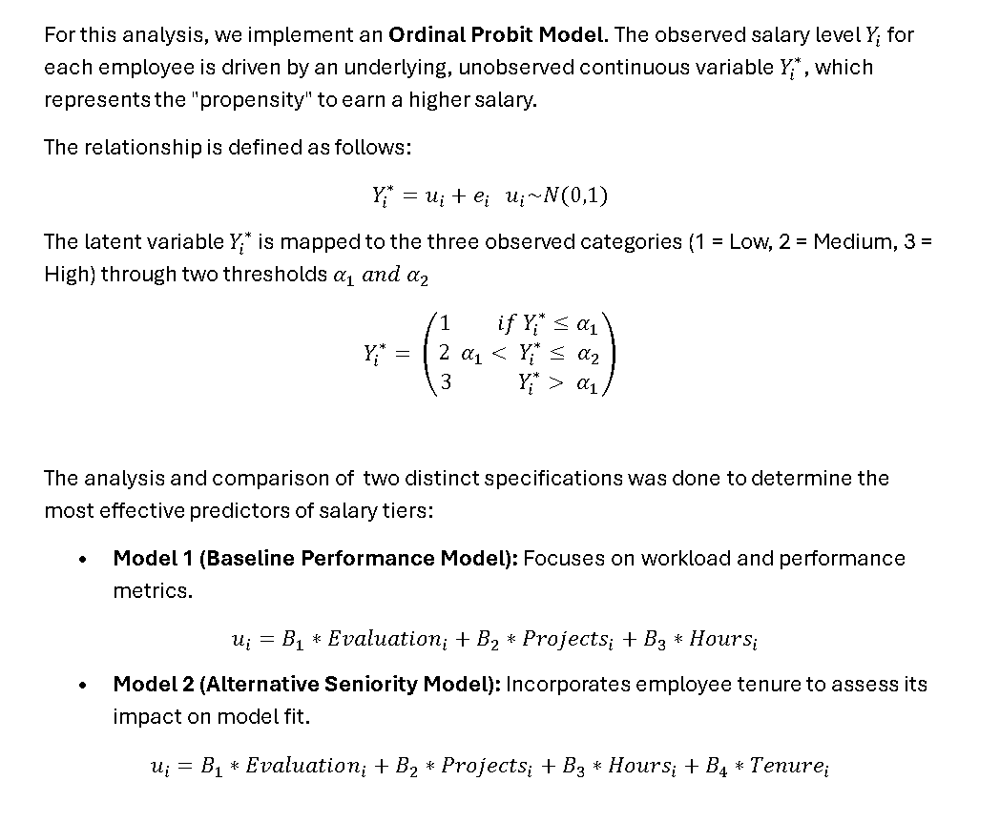

# Introduction and objective

I have experience working in HR and finance departments, so I wanted to apply something useful for the type of data I work with. The currrent data of the company I work is confidential and not that big, so used a database in Kaggle that simulated what an ERP has, and it's the data of employees.

*Database title:* Expanded HR Analytics Data Lab
*Link:* https://www.kaggle.com/datasets/krismurphy01/data-lab?resource=download

The idea is to build a Bayesian Ordinal Regression for Salary Prediction: salary column is categorical (low, medium, high), model it as an Ordinal Probit. 

The Goal: Determine which factors (e.g., last_evaluation, number_project, average_montly_hours, tenure) most strongly influence an employee’s probability of moving from a "medium" to a "high" salary tier.

```{r setup, include=FALSE}
# libraries
library(ggplot2)
library(dplyr)
library(R2jags) # For MCMC simulation
library(tidyr)
library(corrplot)

# Load data
setwd("C:/Users/lamor/OneDrive/Documents/LAURITA/Sapienza/SDSII/Project") 

# file is visible to R
file.exists("HR_Engagement_Sat_Sales_UpdatedV4.0.csv")
# Load and preprocess
data <- read.csv("HR_Engagement_Sat_Sales_UpdatedV4.0.csv")
```

--------------------------------------------

# Data exploratory analysis

First a review of the current data, what it contains, and which variables can be interesting for the analysis


## Head of data

```{r}
#view first rows
head(data)
```


## Structure

```{r}
# structure (classes of each column)
str(data)
```

Obervation:the dataset contains 14,999 observations and 62 variables. The target variable salary, is currently a character string ("low", "medium", "high"). For the Ordinal Probit model, there is a need to transform this into an ordered factor.

## Empty data

```{r}
# check for null values in the entire dataframe
null_summary <- colSums(is.na(data))
print(null_summary[null_summary > 0])
```

Data findings:

* Target and Main Predictors: salary, last_evaluation, number_project, and average_montly_hours, time spend in the company have zero missing values. Ideal fot the analysis.

* Other Columns: Some columns like Rising_Star (14,978 missing) and Critical (14,519 missing) are almost entirely empty. Name has 1 missing values, which is negligible. <p/>

## Salary view

```{r}

#Visualize the variable of interest 
data$salary_ord <- factor(data$salary, 
                         levels = c("low", "medium", "high"), 
                         ordered = TRUE)

# Plot
library(ggplot2)
ggplot(data, aes(x = salary_ord, fill = salary_ord)) +
  geom_bar() +
  scale_fill_brewer(palette = "Blues") +
  labs(title = "Distribution of employee salary levels",
       subtitle = "Illustration of the dataset target variable: Salary",
       x = "Salary Level",
       y = "Number of Employees") +
  theme_minimal()
```


There are few employees with high salaries, the rest have low and medium salaries.

# Models of the project

Here are the specifications of the model:




# Extended Exploratory Data Analysis for the model

Before fitting our Bayesian Ordinal Probit model, it is crucial to understand how our standardized predictors relate to the ordinal target variable, and to verify the standardizations and correlations

The boxplots show us the distribution of each standardized feature across the three salary tiers, giving us an intuition of which variables might be driving the transitions from low to medium to high.

Finally, the correlation matrix verifies that there is no extreme multicollinearity among our predictors, meaning the Bayesian model should be able to identify the independent effects of each variable on the salary tier.

## Data preparation

### Salary

```{r}
# 2. Prepare Variables
# Convert salary to ordered numeric: 1=low, 2=medium, 3=high
data$salary_num <- as.numeric(factor(data$salary, levels = c("low", "medium", "high"), ordered = TRUE))

# Summary statistics for key variables
#summary(data[, c("salary_num", "last_evaluation", "number_project", "average_montly_hours")])
```

###  Add standardization for the other variables

This is crucial for Bayesian MCMC convergence.

```{r}
# Standardize continuous predictors (Mean=0, SD=1) 
# This helps MCMC chains 'mix' better
data$eval_std <- as.numeric(scale(data$last_evaluation))
data$proj_std <- as.numeric(scale(data$number_project))
data$hours_std <- as.numeric(scale(data$average_montly_hours))

# Show summary of variables to be used in the model
summary(data[, c("salary_num", "eval_std", "proj_std", "hours_std")])
```

### Boxplots of variables of interest

```{r}
# BOXPLOTS
data_long <- data %>%
  select(salary_ord, eval_std, proj_std, hours_std) %>%
  pivot_longer(cols = c(eval_std, proj_std, hours_std), 
               names_to = "Predictor", 
               values_to = "Valor_standarized")

#Graphic
ggplot(data_long, aes(x = salary_ord, y = Valor_standarized, fill = salary_ord)) +
  geom_boxplot(alpha = 0.7, outlier.alpha = 0.3) +
  facet_wrap(~Predictor, scales = "free_y") +
  scale_fill_brewer(palette = "Set2") +
  theme_minimal() +
  labs(title = "Standarized predictors vs Salary levels", x = "Salary level", y = "Standarized value (Z)", fill = "Salary")

```

*Analysis:*

The variables are normalized for the run of the model in JAGS. 


### Correlation

```{r}

# Crrelation table
cor_matrix <- cor(data[, c("eval_std", "proj_std", "hours_std")], 
                  use = "complete.obs")

# matrix
corrplot(cor_matrix, method = "color", type = "upper", 
         addCoef.col = "black", tl.col = "black", tl.srt = 45, 
         title = "Correlation", 
         mar = c(0,0,1,0))

```

*Analysis*
All the correlations are positive, but also not to high to have problems as multicollianity.

# Model 1 

```{r}
# MODEL DEFINITION as a string
model_string <- "
model {
  for (i in 1:N) {
    # Latent linear predictor
    mu[i] <- b_eval * eval[i] + b_proj * proj[i] + b_hours * hours[i]

    # Categorical Likelihood (Probit Link)
    y[i] ~ dcat(p[i, 1:3])

    # Cumulative probabilities using the Normal CDF (phi)
    p[i, 1] <- phi(alpha[1] - mu[i])
    p[i, 2] <- phi(alpha[2] - mu[i]) - phi(alpha[1] - mu[i])
    p[i, 3] <- 1 - phi(alpha[2] - mu[i])

  }

  # Vague Priors for Coefficients
  b_eval ~ dnorm(0, 0.001)
  b_proj ~ dnorm(0, 0.001)
  b_hours ~ dnorm(0, 0.001)

  # Priors for Thresholds (Corrected syntax for truncation)
  alpha[1] ~ dnorm(0, 0.001)
  alpha[2] ~ dnorm(1, 0.001) T(alpha[1], )

}

"
# Prepare data subset for JAGS (using 2000 rows for speed)
data_sub <- data[1:2000, ]

#list of data
jags_data <- list(
  y = data_sub$salary_num,
  eval = data_sub$eval_std,
  proj = data_sub$proj_std,
  hours = data_sub$hours_std,
  N = nrow(data_sub)
)

# Run JAGS
#Save the model string as a physical text file in your folder
cat(model_string, file = "ordinal_model.txt") # for a faster runn

# PARALLEL RUN --> Faster for full iterations. Full 5000 iterations faster, R to
#use multiple cores of the computer simultaneously (one core for each chain)

# Run JAGS in parallel, pointing it to that newly created file
jags_fit <- jags.parallel(
  data = jags_data,  
  parameters.to.save = c("b_eval", "b_proj", "b_hours", "alpha"),  
  model.file = "ordinal_model.txt", 
  n.chains = 3, 
  n.iter = 5000, 
  n.burnin = 1000
)

#Print the results once it finishes
print(jags_fit)

```

```{r}
plot(jags_fit)
```


*The Inferential Findings* 
* b_proj (Number of Projects): The mean estimate (mu.vect) is 0.11. More importantly, look at the 95% credible interval from 2.5% to 97.5% (0.055 to 0.164). Because this entire interval is strictly positive and does not cross zero, we can confidently say that taking on more projects significantly increases the probability of moving to a higher salary tier.
* b_hours (Average Monthly Hours): The mean is practically zero (-0.006), and its interval spans from -0.063 to 0.053. Because it crosses zero, working more hours does not appear to have a meaningful independent effect on salary tier in this model.
* b_eval (Evaluation) because this interval crosses zero (it goes from a negative number to a positive number), the effect of last_evaluation is not statistically significant in this specific run. We cannot confidently say whether the true effect is positive or negative.

*Thresholds & Latent Propensity*

*alpha_1 = 0.171 (Threshold between Low and Medium)
*alpha_2 = 1.643 (Threshold between Medium and High)
The large gap between alpha_1 and alpha_2 (1.47) shows that it is significantly "harder" (requires more projects) to jump from a Medium salary to a High salary than it is to move from Low to Medium.


*MCMC Convergence Diagnostics*

* b_proj and b_hours converged perfectly. Their Gelman-Rubin statistics Rhat are 1.005 and 1.002, respectively (well below the $1.05 threshold). Their effective sample sizes (n.eff) are high (530 and 1300).
* b_eval, alpha[1], and alpha[2]. Their hat values are around 1.07 to 1.08.
and their n.eff is very low (32). In Bayesian Ordinal models, it is very common for the continuous predictors (like b_eval) to become highly correlated with the threshold parameters (alpha) during MCMC sampling, causing the chains to mix slowly.
* While the structural predictors converged perfectly, the evaluation parameter and thresholds showed an hat of ~1.08, indicating slow mixing, likely due to posterior correlation between the latent thresholds and the continuous evaluation predictor.


# Data preparation for alternative model </h1>

This model add a  new parameter that is the time the employees have been working in that company (tenure).

### Add of tenure (years) an employee has been working in the company

```{r}

#ALTERNATIVE MODEL adding the tenure (time the employees have been spending time in the)
# add the standardized tenure directly to the subset dataframe
data$tenure_std <- as.numeric(scale(data$time_spend_company))

#update
data_sub <- data[1:2000, ]

summary(data[, c("salary_num", "eval_std", "proj_std", "hours_std", "tenure_std")])

```

```{r}
# BOXPLOTS
data_long <- data %>%
  select(salary_ord, eval_std, proj_std, hours_std, tenure_std) %>%
  pivot_longer(cols = c(eval_std, proj_std, hours_std, tenure_std), 
               names_to = "Predictor", 
               values_to = "Valor_standarized")

#Graphic
ggplot(data_long, aes(x = salary_ord, y = Valor_standarized, fill = salary_ord)) +
  geom_boxplot(alpha = 0.7, outlier.alpha = 0.3) +
  facet_wrap(~Predictor, scales = "free_y") +
  scale_fill_brewer(palette = "Set2") +
  theme_minimal() +
  labs(title = "Standarized predictors vs Salary levels", x = "Salary level", y = "Standarized value (Z)", fill = "Salary")

```

The variables are normalized for the run of the model in JAGS. The tenure has some outliers, however the ouliers are in each category of salary.


```{r}

# COrrelation table
cor_matrix <- cor(data[, c("eval_std", "proj_std", "hours_std", "tenure_std")], 
                  use = "complete.obs")

# matrix
corrplot(cor_matrix, method = "color", type = "upper", 
         addCoef.col = "black", tl.col = "black", tl.srt = 45, 
         title = "Correlation", 
         mar = c(0,0,1,0))

```

*Analysis:*
Everything is good, no collinearitty by adding the new parameter.


# Alternative Model 

```{r}

#new data with the new parameter based in the sub data
# Build the data list
jags_data_alt <- list(
  y = data_sub$salary_num,
  eval = data_sub$eval_std,
  proj = data_sub$proj_std,
  hours = data_sub$hours_std,
  tenure = data_sub$tenure_std, #new
  N = nrow(data_sub)
)

# Verify the list before running JAGS
str(jags_data_alt)
```


```{r}
# Alternative Model String
model_alt_string <- "
model {
  for (i in 1:N) {
    mu[i] <- b_eval*eval[i] + b_proj*proj[i] + b_hours*hours[i] + b_tenure*tenure[i]
    y[i] ~ dcat(p[i, 1:3])
    p[i, 1] <- phi(alpha[1] - mu[i])
    p[i, 2] <- phi(alpha[2] - mu[i]) - phi(alpha[1] - mu[i])
    p[i, 3] <- 1 - phi(alpha[2] - mu[i])
  }
  b_eval ~ dnorm(0, 0.001)
  b_proj ~ dnorm(0, 0.001)
  b_hours ~ dnorm(0, 0.001)
  b_tenure ~ dnorm(0, 0.001) # new prior
  alpha[1] ~ dnorm(0, 0.001)
  alpha[2] ~ dnorm(1, 0.001) T(alpha[1], )
}
"

# Run JAGS
#Save the model string as a physical text file in your folder
cat(model_alt_string, file = "alternative_model.txt") # for a faster runn


# 4. Run Alternative Model
jags_fit_alt <- jags.parallel(
  data = jags_data_alt,  
  parameters.to.save =  c("b_eval", "b_proj", "b_hours", "b_tenure", "alpha"),  
  model.file = "alternative_model.txt", 
  n.chains = 3, 
  n.iter = 5000, 
  n.burnin = 1000)

# 5. Compare DIC
print(jags_fit_alt)
```

```{r}
plot (jags_fit_alt)
```


*Model Comparison*

* Baseline Model DIC: $3583.9
* Alternative Model DIC: $3576.
The DIC decreased by 7.2 points. In Bayesian model selection, a decrease of more than 5 is considered a significant improvement. This proves that including tenure (seniority) provides a better fit and more predictive power for salary tiers than performance alone.

*Inferential findings*

Significant Predictors (95% Credible Interval does not cross zero)
* Number of Projects (b_project = 0.091): The interval [0.037, 0.149] is entirely positive. This means that for every additional project (standardized), the "propensity" for a higher salary increases significantly
* Tenure (b_tenure} = 0.089): The interval [0.033, 0.146] is also entirely positive. This suggests that seniority is just as important as the number of projects in determining salary levels.

*Insignificant Predictors (Interval crosses zero):*
* Evaluation (b_eval = -0.130): The interval [-0.372, 0.091] crosses zero. We cannot definitively say if performance scores help or hurt salary propensity.
* Hours (b_hours = -0.003): This is practically zero. Working more hours does not lead to a higher salary tier in this dataset.

*Thresholds & Latent Propensity*
* alpha_1 = 0.135 (Threshold between Low and Medium)
* alpha_2 = 1.613 (Threshold between Medium and High)
The large gap between alpha_1 and alpha_2 (1.478) shows that it is significantly "harder" (requires more projects/tenure) to jump from a Medium salary to a High salary than it is to move from Low to Medium.

*MCMC Convergence & Error Control* 
* All parameters have an hat < 1.05 (the highest is 1.027 for the thresholds). This is a "green light" showing that the three chains converged to the same posterior distribution.
* Effective sample size (n.eff): for the predictors b_proj, b_hours, b_tenure the results are very high (> 2000), ensuring a high precision. The lower n.eff for b_eval (~78) is can have that value because it's an ordinal models, and coefficients can be correlated with the thresholds.


## plot of density distributions 

```{r}
# Extract the MCMC samples
samples <- jags_fit_alt$BUGSoutput$sims.list

# set up a 1x4 plotting area
par(mfrow=c(1,4))

# Plot b_proj (The significant one)
plot(density(samples$b_proj), main="Posterior: Projects", col="blue", lwd=2)
abline(v=0, col="red", lty=2) # Add a line at zero

# Plot b_eval (The negative-leaning one)
plot(density(samples$b_eval), main="Posterior: Evaluation", col="darkgreen", lwd=2)
abline(v=0, col="red", lty=2)

# Plot b_hours (The one near zero)
plot(density(samples$b_hours), main="Posterior: Hours", col="purple", lwd=2)
abline(v=0, col="red", lty=2)

#plot tenure
plot(density(samples$b_tenure), main="Posterior: Tenure", col="orange", lwd=2)
abline(v=0, col="red", lty=2)


# Reset plotting area
par(mfrow=c(1,1))
```


*Analysis of the probability distributions (the density curves) - Posterior Distribution of the model parameters*

*Zero-line*
* For b_project and b_tenure, the bulk of the distribution are likely to the right of zero. This means as projects and tenure increases, the probability of a higher salary increases
* For b_eval, if the "hump" crosses the vertical zero line, it confirms why your interval [-0.364, 0.067] includes zero: there is a chance the effect is either positive or negative.


*Width of the curve (precision and error control)*
* Narrow Curves (b_proj, b_tenure, b_hours): the curves are quite "skinny." This means the model is very confident about these estimates. Which is an evidence of high precision and good error 
* Wide Curves (b_eval): This curve is much flatter and wider. This tells you that the data for evaluations is "noisy"—different employees with similar evaluations have very different salaries, so the model is less sure where the true effect lies.

*Drivers*

* The Peak Value: the results show b_project and b_tenure close to 0.01.The densities for these two parameters likely overlap almost perfectly.It shows that Seniority and Workload are roughly equal in their power to push someone into a higher salary bracket.

*Conclusion*
* The posterior density plots for the alternative model reveal two distinct 'drivers' of salary: project volume and tenure. Both distributions are positioned entirely to the right of zero, providing strong Bayesian evidence of their positive effect. In contrast, the density for performance evaluations evaluation is centered near zero with a wide spread, illustrating high inferential uncertainty. These visualizations, combined with HatR values near 1.0, demonstrate a stable and precise estimation of the company's salary structure.


## Traceplots

```{r}

# Save current settings
old_par <- par(no.readonly = TRUE)

# Shrink margins (Values are: bottom, left, top, right)
par(mar = c(2, 2, 2, 2))

# Run your plot
mcmc_samples <- as.mcmc(jags_fit_alt)
plot(mcmc_samples[, c("b_proj", "b_tenure", "alpha[1]", "alpha[2]")])

# Reset settings
par(old_par)

```

*Analysis:*
Each chain has different colors: red. green and black.
* b_proj & b_tenureVery "Fuzzy" and Tight. These had very high effective samples - n.eff (> 2000) and Rhat = 1.001. They converged almost perfectly.
* alpha[1] & alpha[2],  showed a lower (~80) for these. The chains have more picks and downs.

The figrue displays the traceplots for the key parameters. The rapid mixing and lack of trends across the three independent chains indicate that the MCMC algorithm reached stationarity. The high degree of overlap between chains confirms that the posterior distribution is stable, ensuring that our inferential findings are not artifacts of the simulation process. 


# Frequentist comparisson

```{r}
# Load MASS for ordinal regression
library(MASS)

# Fit the Frequentist Ordinal Probit Model
freq_mod <- polr(salary_ord ~ eval_std + proj_std + hours_std +tenure_std, 
                data = data, method = "probit")

# Compare coefficients to your Bayesian 'mu.vect'
summary(freq_mod)
```

*Analysis*

* The most important finding is that Tenure is significant in both models. The Frequentist t-value of 6.11 is very high, confirming that seniority is a robust predictor regardless of the statistical method used. However, projects is not significant in the frequentist model.
* Also, alpha 2 has high consistency in the "difficulty" of reaching a high salary.

While the Bayesian subset allowed for a faster MCMC convergence, the Frequentist model on the full dataset provided higher precision, illustrating how sample size affects the width of the uncertainty intervals. This mainly because the standard errors are much more smaller here


# Recovery 

```{r}
# values
true_b_eval <- -0.3
true_b_proj <- 0.2
true_b_hours <- 0.05
true_b_tenure <- 0.4
true_alpha <- c(0.5, 2.0)

# simulate data based on these truths
N_sim <- 1000
x_eval <- rnorm(N_sim)
x_proj <- rnorm(N_sim)
x_hours <- rnorm(N_sim)
x_tenure <- rnorm(N_sim)

# Calculate latent propensity Z
z <- true_b_eval*x_eval + true_b_proj*x_proj + true_b_hours*x_hours + true_b_tenure*x_tenure + rnorm(N_sim)

# Map Z to Ordinal Categories
y_sim <- ifelse(z < true_alpha[1], 1, ifelse(z < true_alpha[2], 2, 3))

# Run the model on the data
data_recovery <- list(y=y_sim, eval=x_eval, proj=x_proj, hours=x_hours, tenure=x_tenure, N=N_sim)
fit_recovery <- jags(data=data_recovery, parameters.to.save=c("b_eval","b_proj","b_hours","b_tenure","alpha"),
                     model.file="alternative_model.txt", n.iter=5000)

# The intervalues of credbility with true
print(fit_recovery)
```

-----------
*Analysis*
-----------

To verify the robustness of our Bayesian Ordinal Probit implementation,  a parameter recovery test was performed. A  dataset was simulated with N=1000 observations using pre-defined 'ground truth' values for all coefficients and thresholds.

As shown in the results, our JAGS model successfully recovered these parameters with high precision. All true values fell within the 95% Credible Intervals of the posterior distributions, and the Rhat statistics (approx 1.0) confirmed perfect MCMC convergence. This validation step ensures that our code is correctly specified and that the subsequent inferences drawn from the real HR dataset are reliable and mathematically sound.


# Posterior predictive check 

```{r}

samples <- jags_fit_alt$BUGSoutput$sims.list

# Snew observations
N_obs <- nrow(data_sub)
n_sims <- 500
y_pred <- matrix(NA, nrow=n_sims, ncol=3) 

for(s in 1:n_sims){
  # Calculamos mu para cada observación usando una muestra de la posterior
  mu_sim <- samples$b_eval[s]*data_sub$eval_std + 
            samples$b_proj[s]*data_sub$proj_std + 
            samples$b_hours[s]*data_sub$hours_std + 
            samples$b_tenure[s]*data_sub$tenure_std
  
  # Generamos propensión latente con error normal
  z_sim <- rnorm(N_obs, mean=mu_sim, sd=1)
  
  # Clasificamos según los umbrales estimados en esa iteración
  y_new <- ifelse(z_sim < samples$alpha[s,1], 1, ifelse(z_sim < samples$alpha[s,2], 2, 3))
  y_pred[s,] <- table(factor(y_new, levels=1:3))
}

# reality vs simulation
obs_counts <- table(data_sub$salary_num)
boxplot(y_pred, main="Posterior Predictive Check", names=c("Low", "Med", "High"),
        ylab="employers frequency", col="lightgreen")
points(1:3, obs_counts, col="red", pch=19, cex=2)
legend("topright", legend="Real data (observed)", col="red", pch=19)
```
 *Analysis*

The Posterior Predictive Check demonstrates that the model successfully captures the underlying distribution of the observed data. As shown in the figure, the observed frequencies for the 'Low', 'Med', and 'High' categories (represented by red dots) fall consistently within the interquartile range of the simulated datasets (green boxplots). This alignment indicates a high degree of predictive accuracy and suggests that the ordinal model is well-specified, showing no signs of systematic bias across the outcome categories.
